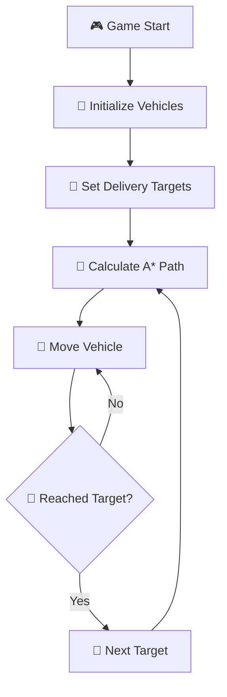

# 🏙️ Smart City Delivery Simulation

<div align="center">


**🚚 An intelligent 3D city simulation featuring autonomous delivery vehicles with advanced pathfinding algorithms**

[🎮 Play Demo](#-getting-started) • [📖 Documentation](#-documentation) • [🐛 Report Bug](#-contributing) • [💡 Request Feature](#-contributing)

</div>

---

## 📋 Table of Contents

- [🌟 Features](#-features)
- [🎯 About The Project](#-about-the-project)
- [🏗️ Built With](#️-built-with)
- [🚀 Getting Started](#-getting-started)
  - [📋 Prerequisites](#-prerequisites)
  - [⚙️ Installation](#️-installation)
- [🎮 Usage](#-usage)
- [🖼️ Screenshots](#️-screenshots)
- [🏛️ Architecture](#️-architecture)
- [🗺️ Roadmap](#️-roadmap)
- [🤝 Contributing](#-contributing)
- [📄 License](#-license)
- [👥 Contact](#-contact)
- [🙏 Acknowledgments](#-acknowledgments)

---

## 🌟 Features

### 🚗 **Intelligent Vehicle System**
- 🤖 **Autonomous Navigation**: Advanced A* pathfinding algorithm for optimal route planning
- 🚚 **Multi-Vehicle Support**: Handle multiple delivery vehicles simultaneously
- ⚡ **Dynamic Speed Control**: Adaptive speed management based on traffic conditions
- 🔄 **Continuous Delivery Loops**: Vehicles automatically cycle through delivery targets

### 🏙️ **3D City Environment**
- 🌆 **Realistic Urban Layout**: Detailed 3D city with roads, buildings, and landmarks
- 🏢 **Interactive Buildings**: Various building types including residential, commercial, and industrial
- 🛣️ **Road Network**: Complex street system with intersections and traffic flow
- 🌳 **Environmental Elements**: Parks, trees, and urban furniture for immersive experience

### 🎯 **Delivery Management**
- 📍 **Waypoint System**: Strategic delivery points throughout the city
- 📊 **Real-time Status**: Live tracking of delivery progress and vehicle status
- 🎯 **Target Management**: Dynamic assignment and reassignment of delivery targets
- 📈 **Performance Metrics**: Track delivery efficiency and route optimization

### 🔧 **Technical Excellence**
- 🧠 **A* Pathfinding**: Industry-standard pathfinding with priority queue optimization
- 🎮 **Unity Physics**: Realistic vehicle physics and collision detection
- 📱 **UI Integration**: Clean, intuitive user interface with TextMeshPro
- 🔄 **Modular Design**: Extensible codebase for easy feature additions

---

## 🎯 About The Project

The **Smart City Delivery Simulation** is a cutting-edge 3D simulation built with Unity that demonstrates intelligent autonomous vehicle navigation in an urban environment. This project showcases advanced pathfinding algorithms, realistic physics simulation, and sophisticated city planning concepts.

### 🎪 **What Makes This Special?**

- 🚀 **Real-world Application**: Simulates actual delivery logistics scenarios
- 🧠 **AI-Powered**: Uses advanced algorithms for intelligent decision making
- 🎨 **Beautiful Visuals**: Stunning 3D graphics with attention to detail
- 🔧 **Highly Customizable**: Easy to modify and extend functionality
- 📚 **Educational Value**: Perfect for learning game development and AI concepts

### 🎯 **Use Cases**

- 📚 **Educational Tool**: Learn Unity development and AI pathfinding
- 🏢 **Urban Planning**: Visualize traffic flow and delivery optimization
- 🎮 **Game Development**: Foundation for city-building or simulation games
- 🔬 **Research Platform**: Test autonomous vehicle algorithms

---

## 🏗️ Built With

### 🎮 **Core Technologies**
- **[Unity 2021.3.7f1](https://unity.com/)** - Game engine and development platform
- **[C#](https://docs.microsoft.com/en-us/dotnet/csharp/)** - Primary programming language
- **[TextMeshPro](https://docs.unity3d.com/Manual/com.unity.textmeshpro.html)** - Advanced text rendering

### 🧠 **Algorithms & Patterns**
- **A* Pathfinding** - Optimal route calculation
- **Priority Queue** - Efficient pathfinding optimization
- **Component-Based Architecture** - Modular Unity design patterns
- **State Management** - Vehicle behavior control

### 🎨 **Assets & Resources**
- **PolygonStarter** - Low-poly 3D assets
- **ARCADE Racing Car** - Vehicle models and physics
- **Enchanted Elements** - Environmental decorations
- **Food Icon Pack** - UI elements and icons

---

## 🚀 Getting Started

### 📋 Prerequisites

Before you begin, ensure you have the following installed:

- **Unity Hub** (Latest version)
  ```bash
  # Download from: https://unity3d.com/get-unity/download
  ```

- **Unity 2021.3.7f1** or later
  ```bash
  # Install through Unity Hub
  # Minimum system requirements:
  # - Windows 10 64-bit / macOS 10.13+ / Ubuntu 16.04+
  # - Graphics card with DX10 (shader model 4.0) capabilities
  # - 8 GB RAM minimum, 16 GB recommended
  ```

- **Git** (for version control)
  ```bash
  # Windows: Download from https://git-scm.com/
  # macOS: brew install git
  # Linux: sudo apt-get install git
  ```

### ⚙️ Installation

1. **Clone the repository**
   ```bash
   git clone https://github.com/yourusername/smart-city-delivery-simulation.git
   cd smart-city-delivery-simulation
   ```

2. **Open in Unity**
   - Launch Unity Hub
   - Click "Open" and select the project folder
   - Unity will automatically import all assets and dependencies

3. **Configure Project Settings**
   - Ensure the project is set to 3D mode
   - Verify TextMeshPro is properly imported
   - Check that all asset packages are correctly installed

4. **Run the Simulation**
   - Open the `MainScene.unity` from `Assets/Scenes/`
   - Press the Play button in Unity Editor
   - Watch the autonomous vehicles navigate the city! 🚗

---

## 🎮 Usage

### 🎯 **Basic Operation**

1. **Start the Simulation**
   - Load the main scene
   - Press Play in Unity Editor
   - Vehicles will automatically begin their delivery routes

2. **Monitor Progress**
   - Watch the status text for real-time delivery updates
   - Observe vehicles navigating through the city
   - Track multiple vehicles simultaneously

3. **Customize Settings**
   ```csharp
   // Adjust vehicle speed
   public float moveSpeed = 8f;
   
   // Add new delivery targets
   public List<Waypoint> allDeliveryTargets;
   
   // Modify pathfinding behavior
   AStarPath currentPath = new AStarPath(start, destination);
   ```

### 🔧 **Advanced Configuration**

#### **Adding New Delivery Points**
```csharp
// In DeliveryAgent.cs
public void AddDeliveryTarget(Waypoint newTarget)
{
    allDeliveryTargets.Add(newTarget);
}
```

#### **Customizing Vehicle Behavior**
```csharp
// In VehicleMovement.cs
public void SetMovementParameters(float speed, float acceleration)
{
    moveSpeed = speed;
    // Add acceleration logic
}
```

---

## 🖼️ Screenshots

### 🌆 **3D City Overview**

*Stunning 3D isometric view of the smart city featuring diverse buildings, road networks, and green spaces. The image showcases the detailed urban environment with various districts including residential areas, commercial zones, and recreational facilities.*

### 🗺️ **Top-Down Navigation View**

*Strategic top-down view displaying the complete city layout with clearly defined road networks, building blocks, and delivery zones. This perspective highlights the intelligent urban planning and optimal pathfinding routes for delivery vehicles.*

---

## 🏛️ Architecture

### 🧩 **Core Components**

```
📦 Smart City Delivery Simulation
├── 🚗 DeliveryAgent.cs          # Main vehicle controller
├── 🗺️ Waypoint.cs              # Navigation points
├── 🧠 AStar.cs                 # Pathfinding algorithm
├── 🚚 VehicleMovement.cs       # Physics and movement
├── 📊 PriorityQueue.cs         # Optimization structure
└── ⚙️ SetupVehicles.cs        # Vehicle initialization
```

### 🔄 **System Flow**



### 🎯 **Key Classes**

#### **DeliveryAgent** 🚚
- Manages vehicle delivery logic
- Coordinates pathfinding and movement
- Handles target cycling and status updates

#### **AStar** 🧠
- Implements A* pathfinding algorithm
- Calculates optimal routes between waypoints
- Uses heuristic distance calculations

#### **VehicleMovement** ⚡
- Controls vehicle physics and animation
- Manages movement along calculated paths
- Handles destination detection

---

## 🗺️ Roadmap

### 🚀 **Phase 1: Core Enhancement** (Current)
- [x] ✅ Basic A* pathfinding implementation
- [x] ✅ Multi-vehicle support
- [x] ✅ 3D city environment
- [ ] 🔄 Advanced traffic simulation
- [ ] 🔄 Weather system integration

### 🎯 **Phase 2: AI Intelligence** (Q2 2024)
- [ ] 🤖 Machine learning path optimization
- [ ] 📊 Dynamic traffic pattern analysis
- [ ] 🚦 Traffic light synchronization
- [ ] 📈 Performance analytics dashboard

### 🌟 **Phase 3: Advanced Features** (Q3 2024)
- [ ] 🎮 VR/AR support
- [ ] 🌐 Multiplayer capabilities
- [ ] 📱 Mobile platform support
- [ ] 🔌 Plugin system for extensions

### 🚀 **Phase 4: Production Ready** (Q4 2024)
- [ ] 📦 Standalone executable builds
- [ ] 🛠️ Level editor tools
- [ ] 📚 Comprehensive documentation
- [ ] 🎓 Tutorial system

---

## 🤝 Contributing

We love contributions! 🎉 Here's how you can help make this project even better:

### 🌟 **Ways to Contribute**

- 🐛 **Bug Reports**: Found a bug? Let us know!
- 💡 **Feature Requests**: Have an idea? We'd love to hear it!
- 🔧 **Code Contributions**: Submit pull requests
- 📚 **Documentation**: Help improve our docs
- 🎨 **Assets**: Contribute 3D models or textures

### 📝 **Contribution Process**

1. **Fork the Project** 🍴
2. **Create your Feature Branch** 🌿
   ```bash
   git checkout -b feature/AmazingFeature
   ```
3. **Commit your Changes** 💾
   ```bash
   git commit -m 'Add some AmazingFeature'
   ```
4. **Push to the Branch** 🚀
   ```bash
   git push origin feature/AmazingFeature
   ```
5. **Open a Pull Request** 📬

### 🎯 **Development Guidelines**

- Follow Unity coding standards
- Write clear, commented code
- Test your changes thoroughly
- Update documentation as needed
- Use meaningful commit messages

---

## 📄 License

Distributed under the MIT License. See `LICENSE` for more information.

```
MIT License

Copyright (c) 2024 Smart City Delivery Simulation

Permission is hereby granted, free of charge, to any person obtaining a copy
of this software and associated documentation files (the "Software"), to deal
in the Software without restriction, including without limitation the rights
to use, copy, modify, merge, publish, distribute, sublicense, and/or sell
copies of the Software...
```

---

## 👥 Contact

### 🚀 **Project Maintainer**
- **Your Name** - [@yourusername](https://twitter.com/yourusername)
- **Email**: your.email@example.com
- **LinkedIn**: [Your LinkedIn](https://linkedin.com/in/yourprofile)

### 🔗 **Project Links**
- **Repository**: [https://github.com/yourusername/smart-city-delivery-simulation](https://github.com/yourusername/smart-city-delivery-simulation)
- **Live Demo**: [Coming Soon!](#)
- **Documentation**: [Wiki](https://github.com/yourusername/smart-city-delivery-simulation/wiki)

---

## 🙏 Acknowledgments

### 💎 **Special Thanks**

- **[Unity Technologies](https://unity.com/)** - For the amazing game engine
- **[A* Pathfinding Community](https://en.wikipedia.org/wiki/A*_search_algorithm)** - For algorithmic inspiration
- **Asset Store Creators** - For beautiful 3D assets and tools
- **Open Source Community** - For continuous inspiration and support

### 🎨 **Asset Credits**

- **PolygonStarter** - Low-poly city assets
- **ARCADE Racing Car** - Vehicle models and physics
- **Enchanted Elements** - Environmental decorations
- **TextMeshPro** - Advanced text rendering system

### 🏆 **Inspiration**

This project was inspired by real-world smart city initiatives and the growing need for efficient urban logistics solutions. Special recognition to cities like Singapore, Barcelona, and Amsterdam for their innovative smart city implementations.

---

<div align="center">

### 🌟 **Star this project if you found it helpful!** ⭐

**Made with ❤️ and lots of ☕**

[⬆ Back to Top](#-smart-city-delivery-simulation)

</div>