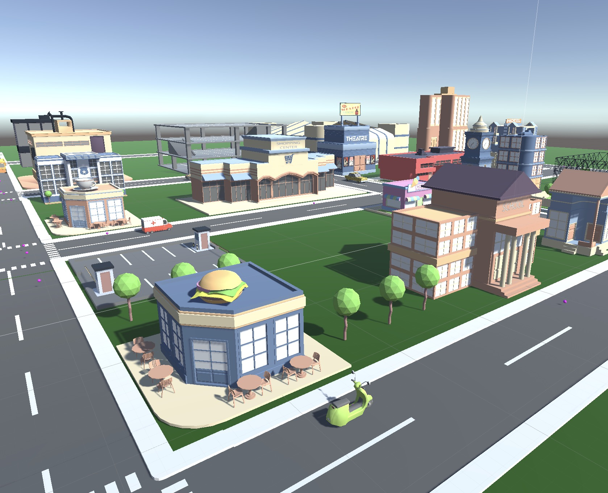
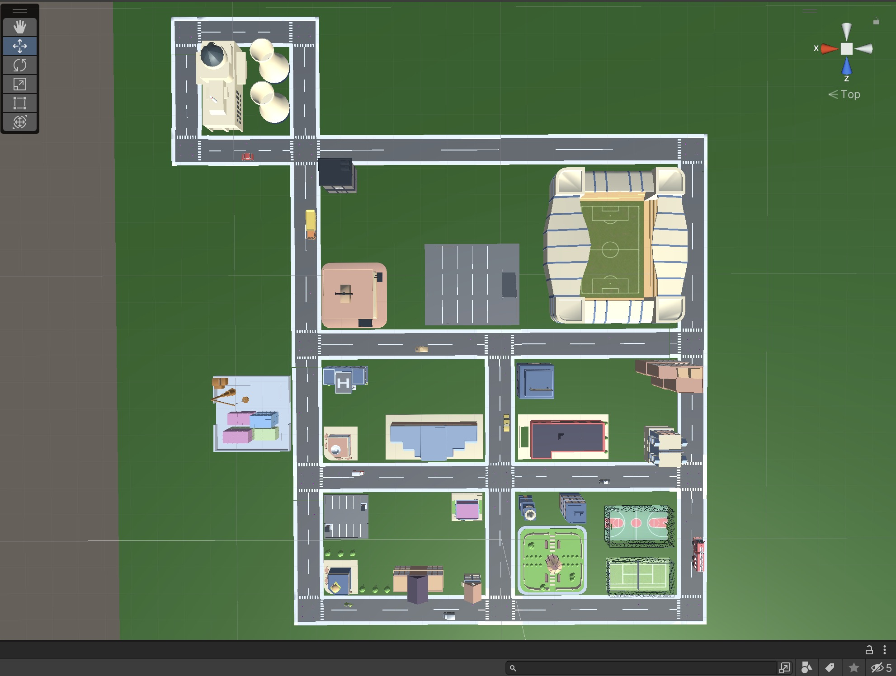

<div align="center">

# 🍕 Food Delivery Legend 🚗

### 🎮 An Addictive 3D Food Delivery Simulation Game 
### 🌟 Experience the Thrilling Journey of Becoming a Delivery Legend in a Virtual City!

[](https://unity.com/)
[](https://docs.microsoft.com/en-us/dotnet/csharp/)
[](LICENSE)
[](https://unity.com/)


*🏙️ Beautiful 3D city environment featuring various restaurants and landmark buildings*

---

</div>

## 📖 Table of Contents

- [🎯 Game Introduction](#-game-introduction)
- [✨ Core Features](#-core-features)
- [🎮 Game Screenshots](#-game-screenshots)
- [🔧 Technical Architecture](#-technical-architecture)
- [🚀 Installation Guide](#-installation-guide)
- [🎲 Gameplay](#-gameplay)
- [📁 Project Structure](#-project-structure)
- [🛠️ Development Tools](#️-development-tools)
- [🤝 Contributing](#-contributing)
- [📄 License](#-license)
- [👥 Development Team](#-development-team)

---

## 🎯 Game Introduction

**Food Delivery Legend** is a 3D food delivery simulation game developed with Unity Engine! 🎮 In this virtual city, you'll drive delivery vehicles, shuttle between restaurants and customers, and experience the joy of becoming a delivery legend!

### 🌟 Why Choose Our Game?
- 🎨 **Stunning 3D Environment** - Detailed modeled city scenes
- 🧠 **Intelligent Pathfinding** - Optimal routes using A* algorithm
- 🚗 **Realistic Driving Experience** - Smooth vehicle physics system  
- 🏢 **Rich City Life** - Diverse buildings and landmarks
- 📊 **Real-time Status Display** - Clear delivery mission interface

---

## ✨ Core Features

### 🎮 Game Core
- 🚚 **Smart Delivery System** - Automatically plans optimal delivery routes
- 🗺️ **Dynamic Pathfinding** - Real-time navigation based on A* algorithm
- 🏪 **Diverse Restaurants** - Burger shops, cafes, and various eateries
- 🎯 **Mission Management System** - Cycling delivery tasks with progress tracking

### 🔧 Technical Features
- 🧩 **Modular Architecture** - Clean component separation design
- ⚡ **High Performance Rendering** - Optimized 3D graphics processing
- 🎛️ **Flexible Configuration** - Adjustable game parameters
- 🔄 **Real-time Updates** - Smooth game state synchronization

### 🎨 Visual Effects
- 🌆 **3D City Scenes** - Rich architectural details
- 🚦 **Realistic Traffic System** - Complete road network
- 🌳 **Environmental Decoration** - Trees, parks, and natural elements
- 🎪 **Landmark Buildings** - Theaters, stadiums, and distinctive architecture

---

## 🎮 Game Screenshots

<div align="center">


*🎮 Unity Editor scene view showing the complete city layout with restaurants, stadium, roads and various facilities in development mode*

</div>

### 📸 Screenshot Descriptions
- **Top Image**: 3D game main perspective showing delivery vehicles navigating through the city, with a featured burger restaurant 🍔
- **Bottom Image**: Unity Editor scene view displaying the complete city layout in development mode, featuring restaurants, football stadium, road networks, and various urban facilities 🎮

---

## 🔧 Technical Architecture

### 🏗️ System Architecture
```
🎮 Game Core
├── 🚗 Vehicle System (VehicleMovement.cs)
├── 🎯 Delivery Agent (DeliveryAgent.cs)  
├── 🗺️ Pathfinding (AStar.cs)
├── 📍 Waypoint System (Waypoint.cs)
└── ⚙️ Vehicle Setup (SetupVehicles.cs)
```

### 🧠 Core Algorithms
- **A* Pathfinding** 🧭
  - Shortest path calculation
  - Dynamic obstacle avoidance
  - Real-time route replanning

- **Vehicle Physics System** ⚡
  - Smooth movement control
  - Automatic steering system
  - Target point navigation

### 💾 Technology Stack
- **Game Engine**: Unity 2022.3+ 🎮
- **Programming Language**: C# 💻
- **UI System**: TextMeshPro 📝
- **Asset Management**: Unity Asset Pipeline 📦

---

## 🚀 Installation Guide

### 📋 System Requirements
- **Operating System**: Windows 10+ / macOS 10.14+ 💻
- **Unity Version**: 2022.3 LTS or higher 🎮
- **Memory**: 8GB RAM (16GB recommended) 🧠
- **Graphics**: DirectX 11 support 🎨
- **Storage**: 2GB available space 💾

### 🔽 Installation Steps

#### 1️⃣ Clone Project
```bash
git clone https://github.com/yourusername/FoodDeliveryLegend.git
cd FoodDeliveryLegend
```

#### 2️⃣ Open Unity
1. Launch Unity Hub 🎯
2. Click "Open Project" 📁
3. Select project folder 📂
4. Wait for Unity to import assets ⏳

#### 3️⃣ Download Required Assets
Before running the game, you'll need to download the following asset packages:

**🎨 Essential Art Assets:**
- [150+ Food Icon Pack](https://assetstore.unity.com/packages/2d/gui/icons/150-food-icon-pack-56171) - Food delivery icons
- [FREE Food Pack](https://assetstore.unity.com/packages/3d/props/food/free-food-pack-85884) - 3D food models
- [PolygonStarter](https://assetstore.unity.com/packages/3d/environments/landscapes/polygon-starter-pack-156819) - Low poly environment assets

**🚗 Vehicle Assets:**
- [ARCADE - FREE Racing Car](https://assetstore.unity.com/packages/3d/vehicles/land/arcade-free-racing-car-161085) - Racing car models

**🏙️ City Environment:**
- [Toon City Pack](https://assetstore.unity.com/packages/3d/environments/urban/toon-city-pack-32314) - City buildings and props

**🎮 Unity Essentials (Free):**
- [Starter Assets - First Person Controller](https://assetstore.unity.com/packages/essentials/starter-assets-first-person-character-controller-196525) - First person controls
- [TextMeshPro](https://docs.unity3d.com/Manual/com.unity.textmeshpro.html) - Advanced text rendering (included in Unity)

#### 4️⃣ Import Assets
1. Download assets from Unity Asset Store 🛒
2. Import them into your project 📥
3. Follow any specific setup instructions for each asset 📋

#### 5️⃣ Run Game
1. Open `Assets/Scenes/MainScene.unity` 🎬
2. Click Play button ▶️
3. Enjoy the game! 🎉

---

## 🎲 Gameplay

### 🎯 Main Objective
Become the best delivery driver in the city! Complete all delivery missions, shuttle between restaurants, and deliver delicious food to customers!

### 🕹️ Controls
- **Auto Driving** 🤖 - Vehicles automatically navigate to target locations
- **Mission Switching** 🔄 - Automatically take next delivery after completion
- **Route Optimization** 🗺️ - System automatically calculates optimal paths

### 🏆 Game Goals
- 📦 Complete all delivery missions
- ⚡ Improve delivery efficiency
- 🏅 Become a delivery legend!

---

## 📁 Project Structure

```
🗂️ FoodDeliveryLegend/
├── 📂 Assets/
│   ├── 🎨 150+ Food Icon Pack/        # Food icon resources
│   ├── 🚗 ARCADE - FREE Racing Car/   # Racing car model resources  
│   ├── 🍔 FREE Food Pack/             # Free food models
│   ├── 🏢 Loading Games/              # City building resources
│   ├── 🌟 PolygonStarter/             # Polygon style resources
│   ├── 🎬 Scenes/                     # Game scenes
│   │   ├── MainScene.unity            # Main game scene
│   │   └── SampleScene.unity          # Sample scene
│   ├── 📜 Scripts/                    # Core scripts
│   │   ├── AStar.cs                   # A* pathfinding algorithm
│   │   ├── DeliveryAgent.cs           # Delivery agent control
│   │   ├── VehicleMovement.cs         # Vehicle movement system
│   │   ├── Waypoint.cs                # Waypoint definition
│   │   └── SetupVehicles.cs           # Vehicle setup
│   └── 🎵 StarterAssets/              # Unity starter assets
├── 📸 images/                         # Game screenshots
├── 📦 Packages/                       # Unity packages
├── ⚙️ ProjectSettings/                # Project settings
└── 📋 README.md                       # Project documentation
```

---

## 🛠️ Development Tools

### 🎮 Required Tools
- **Unity 2022.3 LTS** - Main development environment
- **Visual Studio / VS Code** - Code editor
- **Git** - Version control system

### 📦 Asset Packages Used
- **TextMeshPro** - High-quality text rendering ✍️
- **150+ Food Icon Pack** - Rich food icons 🍕
- **PolygonStarter** - Low poly style resources 🎨
- **FREE Food Pack** - 3D food models 🍎
- **Toon City Pack** - Cartoon style city 🏙️
- **ARCADE Racing Car** - Vehicle models 🚗
- **Starter Assets** - Character controllers 🎮

### ⚠️ **Important Note**
This project requires several Unity Asset Store packages to function properly. Make sure to download and import all the assets listed in the [Installation Guide](#-installation-guide) before running the project. Without these assets, the game scenes may appear incomplete or broken.

---

## 🤝 Contributing

We welcome all forms of contributions! 🎉

### 🔧 How to Contribute
1. **Fork the Project** 🍴
2. **Create Feature Branch** (`git checkout -b feature/AmazingFeature`) 🌿  
3. **Commit Changes** (`git commit -m 'Add some AmazingFeature'`) 💾
4. **Push to Branch** (`git push origin feature/AmazingFeature`) 🚀
5. **Open Pull Request** 📥

### 🐛 Report Issues
If you find any bugs or have suggestions:
- Open an [Issue](https://github.com/yourusername/FoodDeliveryLegend/issues) 🔍
- Describe the problem in detail 📝
- Provide reproduction steps 🔄

### 💡 Feature Requests
Have new ideas? We'd love to hear them!
- Submit feature requests in Issues 💭
- Explain why the feature would be useful 🤔
- Provide specific use cases 📖

### 📦 Asset Dependencies Notice
Please note that this project uses several Unity Asset Store packages. When contributing:
- **Do not include** copyrighted asset files in your commits
- **Reference** asset packages by name and store link only
- **Test** your changes with the required assets installed
- **Document** any new asset dependencies in the README

---

## 📄 License

This project is licensed under the MIT License. See [LICENSE](LICENSE) file for details.

```
MIT License - You are free to:
✅ Use, copy, modify
✅ Distribute, private use, commercial use  
✅ Place warranty, liability
```

---

## 👥 Development Team

### 🏆 Core Contributors
- **Lead Programmer** 👨‍💻 - Responsible for core system development
- **Game Designer** 🎮 - Responsible for gameplay design  
- **3D Artist** 🎨 - Responsible for scenes and model creation

### 🙏 Special Thanks
Thanks to all creators who provided free resources:
- **150+ Food Icon Pack** authors 🍔
- **Unity Starter Assets** team 🎯
- **PolygonStarter** resource pack creators 🎨
- **Free Food Pack** modelers 🍎

---

<div align="center">

### 🌟 If you like this project, please give us a star! ⭐

**🚗 Start Your Delivery Legend Journey! 🍕**

</div> 
